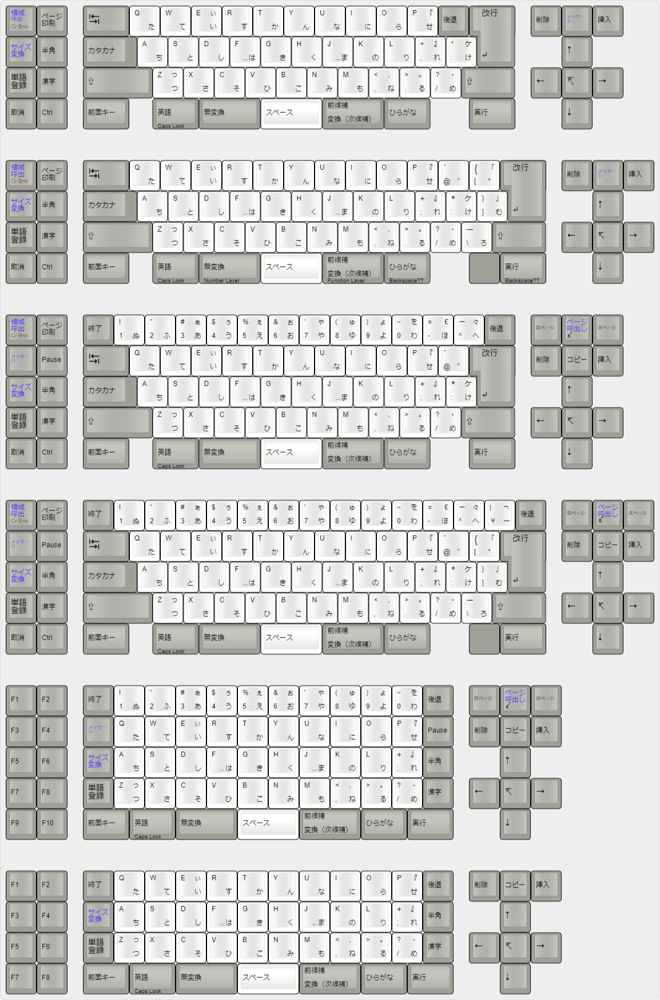

# Mini Battleship

船舶解体計画

## Possible Layouts

## Why?

The build quality of the 5576-001 is pretty terrible. The IBM badge is meh, the indicator lights section is a boring cutout with a crappy overlay that invariably gets damaged, and overall neither case seems to be particularly sturdy - despite being heavier than the P70, it seems to be just as, if not more, flexy. Maybe it's just a product of the post-bubble economy, but 40k JPY for something with this construction feels wrong. If the keyboard had been like a Model M with a steel backplate, I would have left it alone, but as it stands, the board comes with uniquely fun switches and great two-piece Alps dyesub keycaps. 

## APS Notes

Alps Plate Springs are amazing switches that feel like tiny buckling springs even though they are a stacked spring design. The PCB-mount ones from the -001 are especially hilarious (6 pins!) but their plate-mount cousins from the -JA1 seem to be fine as well. I've noticed they are not quite the same in terms of construction as well. Though you can swap the top housings, stems and stem springs, and plate springs, they don't quite sound or feel the same once swapped. For example, swapping a plate-mount plate spring into a PCB-mount causes the click to become more high-pitched and the switch feels a bit "loose" for lack of better words. The top housings also appear to be made of different plastics as they are differently colored.